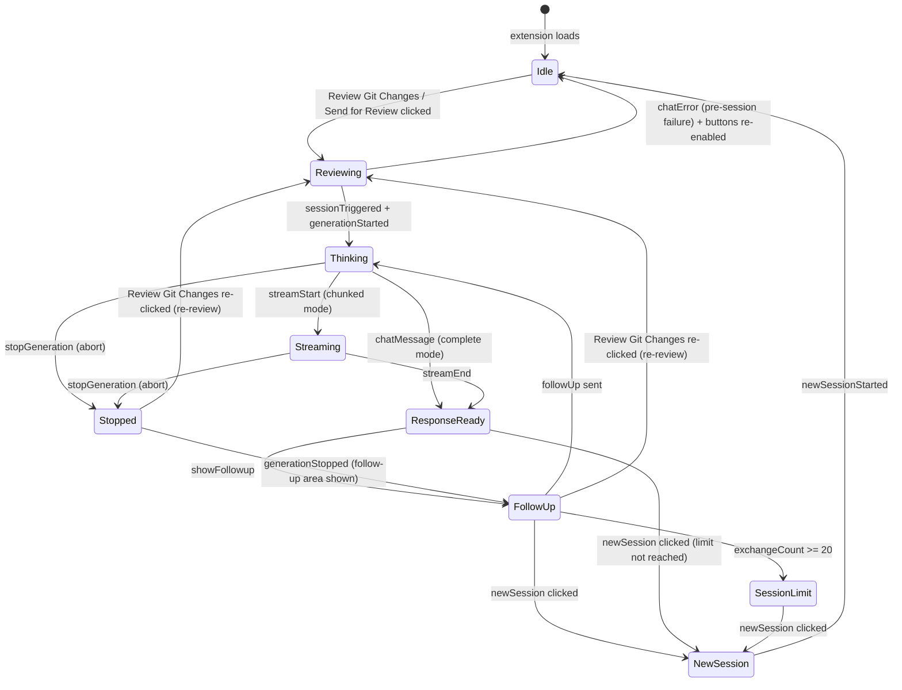
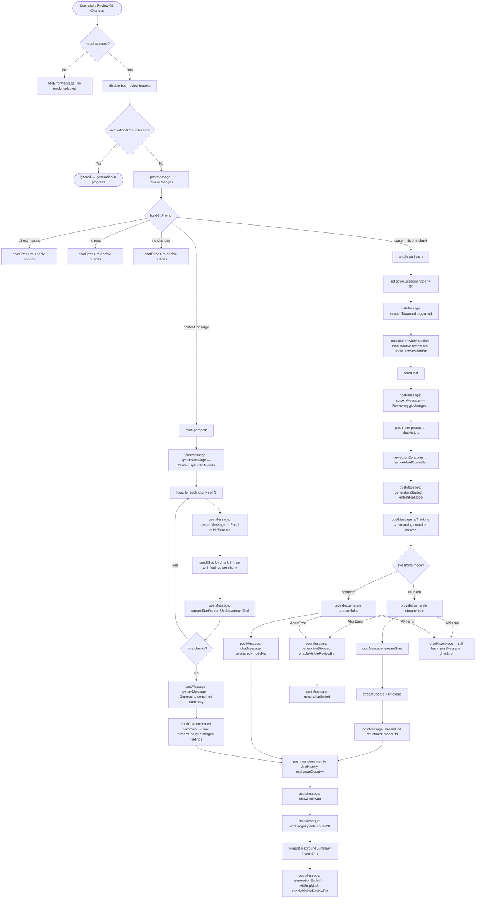
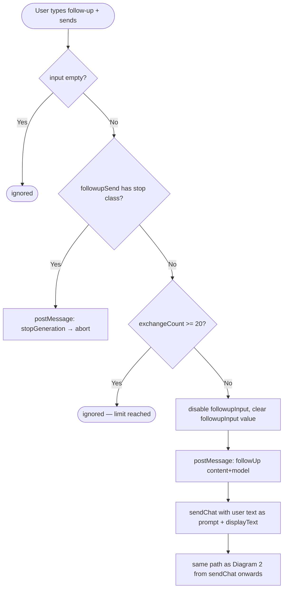
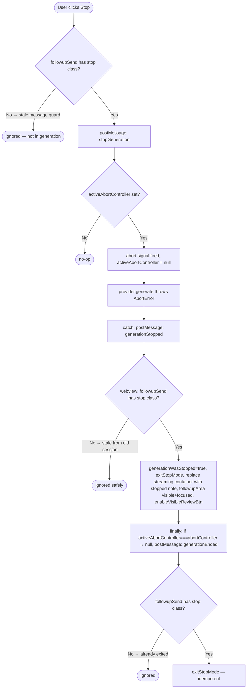
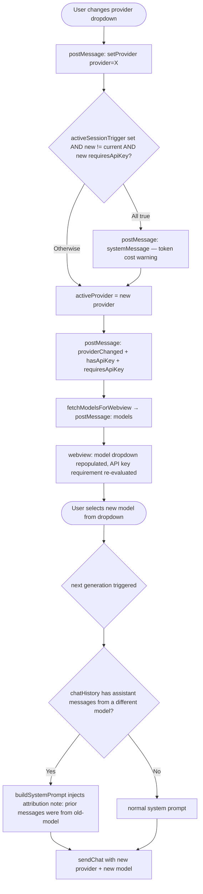
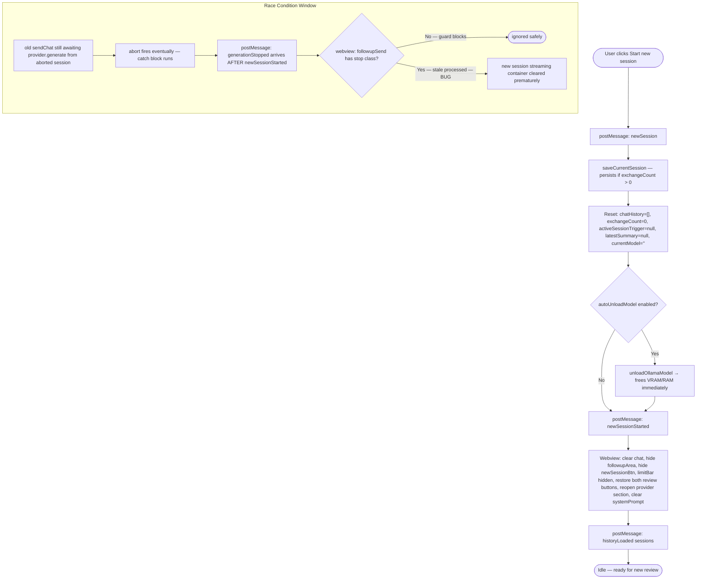
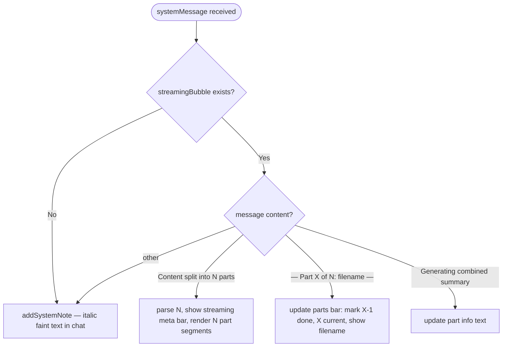

# Extension Workflow Diagrams

Reference for all user interaction paths, state transitions, and message exchanges.
Use this when fixing a bug to understand which conditions are affected and predict other areas at risk.

---

## Diagram 1 — Session Lifecycle (State Machine)



---

## Diagram 2 — Review Git Changes (Happy Path + All Error Paths)



> **Send for Review (Active File)** follows the identical path — only the trigger command (`sendToProvider`), display text ("Reviewing active file..."), and session trigger value (`"file"`) differ. Large files are split by method/function boundary (via VS Code symbol provider) or by line chunks as fallback.

---

## Diagram 3 — Follow-up Message Flow



---

## Diagram 4 — Stop Button Flow + Race Condition Guard



---

## Diagram 5 — Mid-Session Provider/Model Switch

Switching provider or model mid-session does **not** reset the conversation. History and exchange count are preserved. The next generation simply uses the newly selected provider and model.



---

## Diagram 6 — New Session Flow + VRAM Cleanup



---

## Diagram 7 — System Message Routing (Webview)

The `systemMessage` handler routes differently depending on whether a streaming generation is in progress.



---

## Diagram 8 — Settings Panel Interactions

```mermaid
flowchart TD
    A([User opens Settings gear]) --> B[settingsPanel.classList toggle open]

    B --> C{User action}

    C -- Toggle Streaming --> D[postMessage: toggleStreaming mode=chunked|complete]
    C -- Toggle Enhanced Reviewer --> E[postMessage: toggleEnhancedReviewer enabled=true|false]
    E --> E1{Ollama + enabled?}
    E1 -- Yes --> E2[show reviewer section: base model select + create button]
    E1 -- No --> E3[hide reviewer section]

    C -- Select base model + Create --> F[postMessage: createReviewerModel baseModel]
    F --> G[extension: createReviewerModel streams progress]
    G --> H["postMessage: reviewerModelStatus creating|progress|created|error"]

    C -- Delete reviewer model --> I[postMessage: deleteReviewerModelByName modelName]

    C -- Save Ollama URL --> J[postMessage: saveOllamaUrl url]
    C -- Save Pinned Models --> K[postMessage: savePinnedModels models array]
    K --> K1[extension stores to config, refetches model list]

    C -- Save API Key --> L{inline key typed?}
    L -- Yes → send key inline --> M[postMessage: setApiKey provider key]
    L -- No → fallback --> N[extension: showInputBox password prompt]
    M & N --> O[extension: secrets.store, postMessage: apiKeySet]
    O --> P[webview: clear apiKeyInput, update key status indicator]

    C -- Clear API Key --> Q[postMessage: clearApiKey provider]
    Q --> R[extension: secrets.delete, postMessage: apiKeyCleared]
```

---

## Key State Variables — Danger Zones

| Variable | File | Danger Zone |
|---|---|---|
| `activeAbortController` | extension.ts | Old session's `finally` block must not clobber a new session's controller — guarded by identity check `=== abortController` |
| `sessionActive` | webview.js | Gates button re-enable on `chatError`; must be `false` before first `sessionTriggered` fires |
| `generationWasStopped` | webview.js | Keeps follow-up area visible after stop; reset in `enterStopMode` when next generation starts |
| `streamingBubble` | webview.js | Set to `null` on `newSession`; stale `generationStopped` from old session would clear the **new** session's streaming container — guarded by stop-class check |
| `activeSessionTrigger` | extension.ts | `null` = pre-session; gates provider-switch token warning and `sessionTriggered` message |
| `exchangeCount` | extension.ts | NOT rolled back on abort; only rolled back on API error (non-abort); reset on `newSession` |
| `chatHistory` | extension.ts | User message pushed optimistically before generation; only popped on non-abort errors |
| `followupWasVisible` | webview.js | Captured at `enterStopMode`; determines whether follow-up area is hidden on `generationEnded` |
| `streamingEnabled` | webview.js | Tracks current streaming toggle state; synced to extension on change |
| `enhancedEnabled` | webview.js | Tracks enhanced reviewer toggle; controls visibility of reviewer section |
| `streamingPartsTotal` | webview.js | Number of parts in current multi-part review; reset on `aiThinking` |
| `streamingPartCurrent` | webview.js | Current part index in multi-part review; drives parts progress bar |
