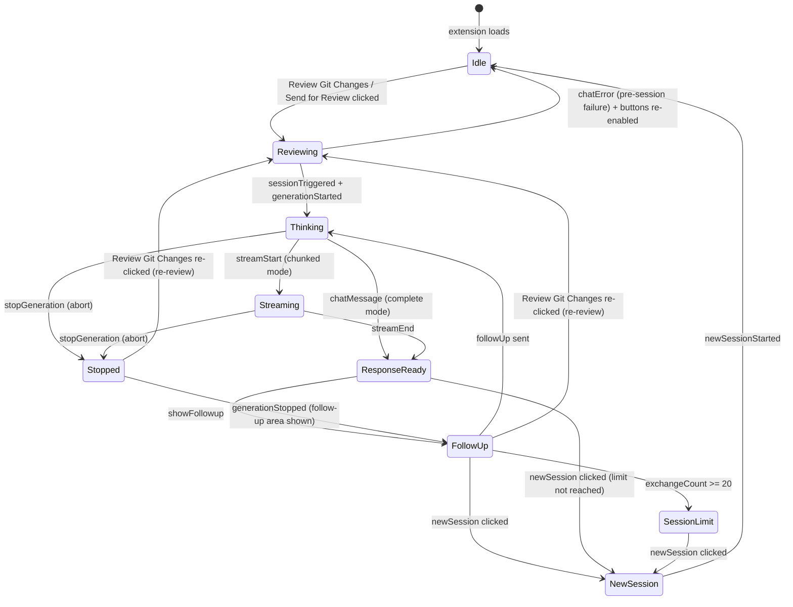
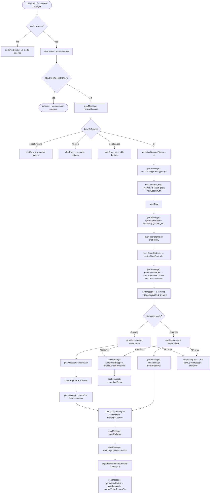
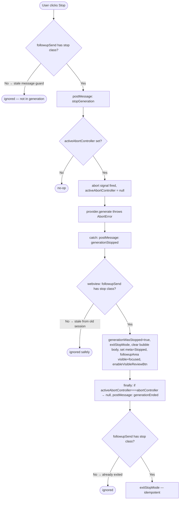
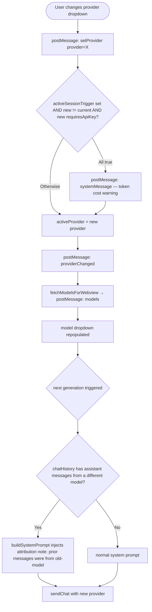
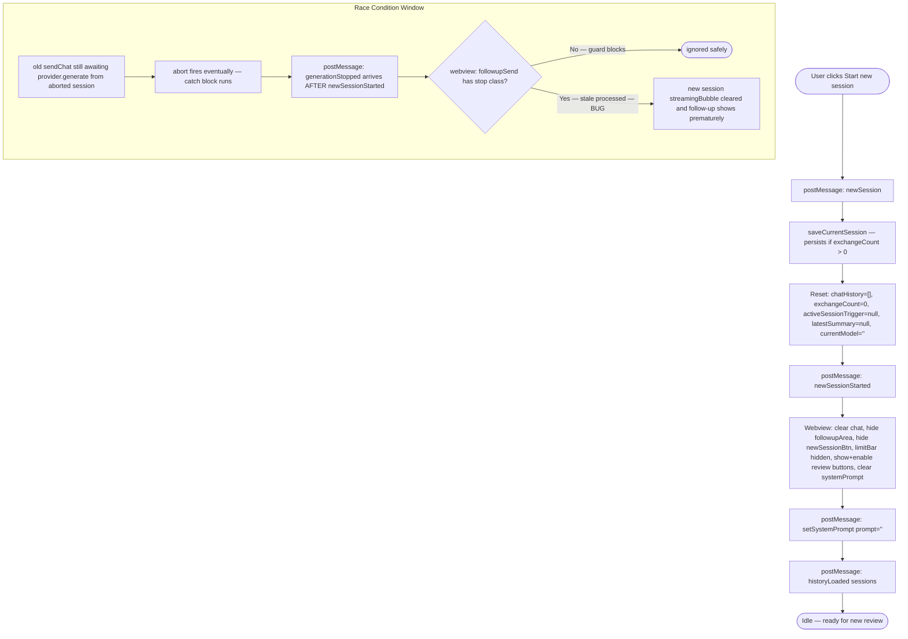
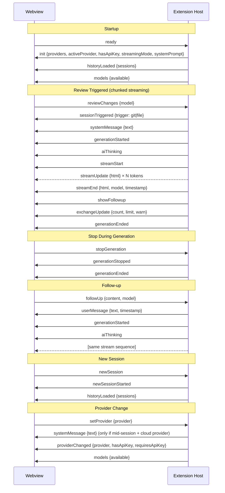

# Extension Workflow Diagrams

Reference for all user interaction paths, state transitions, and message exchanges.
Use this when fixing a bug to understand which conditions are affected and predict other areas at risk.

---

## Diagram 1 — Session Lifecycle (State Machine)

---

## Diagram 2 — Review Git Changes (Happy Path + All Error Paths)

> **Send for Review (Active File)** follows the identical path — only the trigger command (`sendToProvider`), display text ("Reviewing active file..."), and session trigger value (`"file"`) differ.

---

## Diagram 3 — Follow-up Message Flow

---

## Diagram 4 — Stop Button Flow + Race Condition Guard

---

## Diagram 5 — Provider Switch Mid-Session

---

## Diagram 6 — New Session Flow + Stale Message Race Condition

---

## Diagram 7 — Message Protocol Sequence Reference

---

## Key State Variables — Danger Zones

| Variable | File | Danger Zone |
|---|---|---|
| `activeAbortController` | extension.ts | Old session's `finally` block must not clobber a new session's controller — guarded by identity check `=== abortController` |
| `sessionActive` | webview.js | Gates button re-enable on `chatError`; must be `false` before first `sessionTriggered` fires |
| `generationWasStopped` | webview.js | Keeps follow-up area visible after stop; reset in `enterStopMode` when next generation starts |
| `streamingBubble` | webview.js | Set to `null` on `newSession`; stale `generationStopped` from old session would clear the **new** session's bubble — guarded by stop-class check |
| `activeSessionTrigger` | extension.ts | `null` = pre-session; gates provider-switch token warning and `sessionTriggered` message |
| `exchangeCount` | extension.ts | NOT rolled back on abort; only rolled back on API error (non-abort); reset on `newSession` |
| `chatHistory` | extension.ts | User message pushed optimistically before generation; only popped on non-abort errors |
| `followupWasVisible` | webview.js | Captured at `enterStopMode`; determines whether follow-up area is hidden on `generationEnded` |
| `generationWasStopped` | webview.js | Also checked in `exitStopMode` to prevent hiding follow-up after a stop event |
